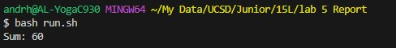
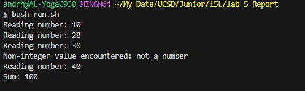

Part 1:

Step 1 Student Post:

Title: Issue with Java Program - Unexpected Behavior

Content:

Hi everyone,

I've written a simple Java program (NumberSum.java) that reads numbers from a file (numbers.txt) and calculates their sum. 
However, when I run the program using my Bash script (run.sh), it's not showing the expected result. Instead, it just stops without any error message. 
Here's a screenshot of the terminal output after running the script:

I suspect the issue might be related to the way the program reads the file or maybe an error in the file content. Can anyone help me figure this out?

Step 2 TA Response:

Context:

Hi,

It looks like the program might be encountering an unexpected value in your numbers.txt file. 
Can you try running the program with the -ea flag to enable assertions, and also add a print statement in your while loop to see what value it reads right before it stops? 
This should give us more insight into where the problem might be.

Step 3 Student Follow Up:
   
Content:
Thanks for the suggestion! I added a print statement and ran the program with the -ea flag. Here's the updated screenshot of my terminal:

It seems like the program is failing to handle a non-integer value in the file. The bug is in the file reading part of the code.

Steo 4 Final Summary:

File & Directory Structure:

NumberSum.java: Java program file, run.sh: Bash script to compile and run the Java program, numbers.txt: Input file containing numbers

Contents of Each File Before Fixing the Bug:

NumberSum.java: (Java code content), run.sh: (Bash script content), numbers.txt: Contained a non-integer value

Commands to Trigger the Bug:

./run.sh

Solution:

Edit numbers.txt to ensure it only contains integer values.

Part 2:

